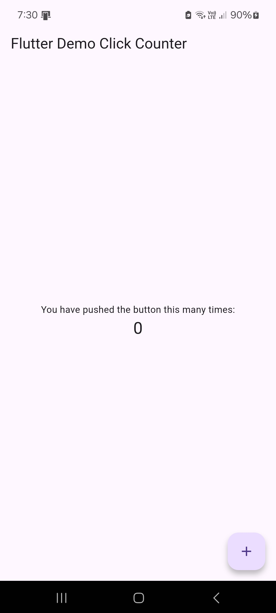
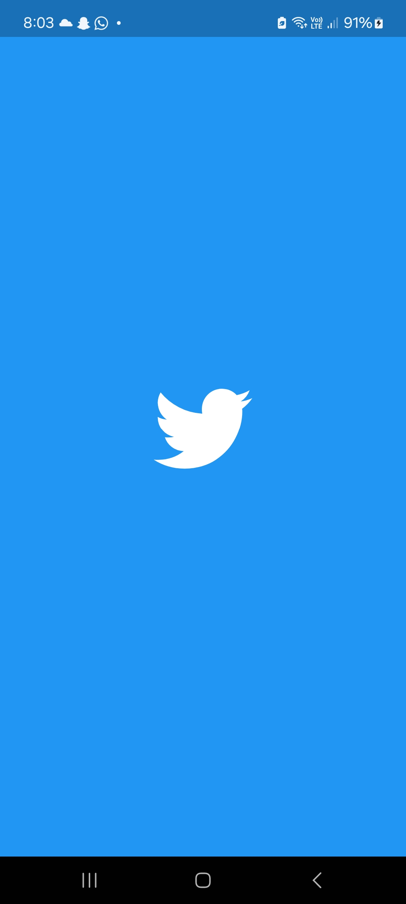
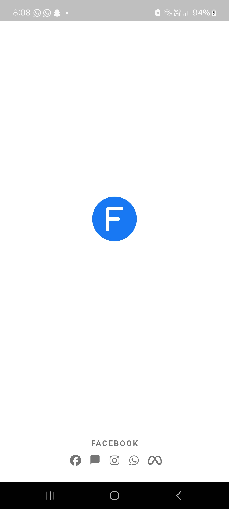
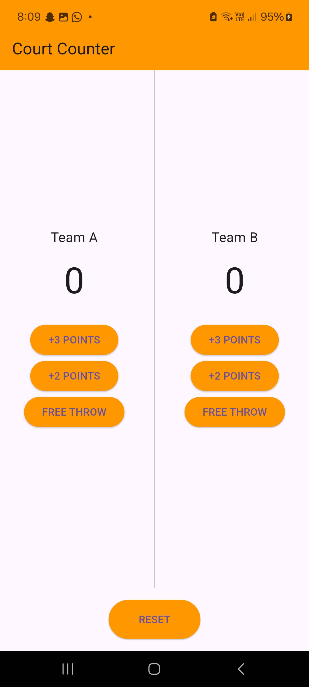

# Multi-Screen App - Lab 4


## 📌 Overview
This is a **Multi-Screen Application** developed for **Mobile Application Development (MAD) Lab 4** at Bahria University. The app demonstrates various Flutter UI and state management concepts by implementing **four unique screens** using a **BottomNavigationBar**.

## 🧭 Screens Included

| Screen Name         | Description                                                |
|---------------------|------------------------------------------------------------|
| Click Counter       | A simple counter that increments with a floating button    |
| Twitter             | Displays the Twitter logo on a themed background           |
| Facebook            | Facebook-themed UI with logo and social icons              |
| Court Counter       | A basketball score counter for Team A and Team B           |

## 📁 Project Structure
```
Lab-Journal-4/
│── android/                 # Android-specific code
│── ios/                     # iOS-specific code
│── lib/                     # Main Flutter source files (contains main.dart)
│── linux/                   # Linux-specific code
│── macos/                   # macOS-specific code
│── web/                     # Web-specific code
│── windows/                 # Windows-specific code
│── .gitignore               # Git ignore rules
│── .metadata                # Flutter project metadata
│── README.md                # Project documentation
│── analysis_options.yaml    # Static analysis options
│── pubspec.lock             # Locked dependency versions
│── pubspec.yaml             # Project dependencies and configuration
│── ss_1.jpg                 # Click Counter Screen
│── ss_2.jpg                 # Twitter Screen
│── ss_3.jpg                 # Facebook Screen
│── ss_4.jpg                 # Court Counter Screen

```

## ✨ Features
- **Bottom Navigation Bar** to navigate between screens.
- **Stateful Widgets** to manage click and score counters.
- **Stateless Widgets** for static screen designs (e.g., Twitter, Facebook).
- **Score Counter Logic** for a basketball-style scoring app.
- Use of **FontAwesome Icons** to enhance UI.

## 🚀 Getting Started
### Prerequisites
Ensure you have the following installed:
- [Flutter SDK](https://flutter.dev/docs/get-started/install)
- Dart (included with Flutter)
- Code editor (VS Code or Android Studio recommended)

### Installation
1. Clone the repository:
   ```bash
   git clone https://github.com/Mobile-Application-Development-CSL-341/Lab-Journal-4.git
   cd Lab_4
   ```
2. Run the app:
   ```bash
   flutter run
   ```

## 📸 Screenshots

### 🔹 Click Counter Screen
<p align="center">
  
</p>

### 🔹 Twitter Screen
<p align="center">
  
</p>

### 🔹 Facebook Screen
<p align="center">
  
</p>

### 🔹 Court Counter Screen
<p align="center">
  
</p>

## 📜 License
This project is for educational purposes only.

## 🙌 Acknowledgments
- **Instructor:** Sir Mohsin Javed Butt  
- **University:** Bahria University E8, Islamabad  
- **Student:** Muhammad Awab Sial  
- **Enrollment No:** 01-134222-091  
- **Class:** BS-CS 6-B
